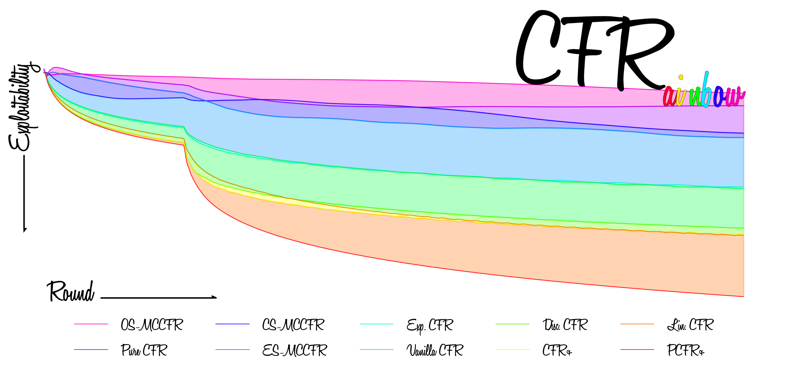

<picture>
  <source media="(prefers-color-scheme: dark)" srcset="docs/cfrainbow_readme_banner_dark.png">
  <source media="(prefers-color-scheme: light)" srcset="docs/cfrainbow_readme_banner_light.png">
  
</picture>

---

# <p align=center> CFRainbow
<p align=center> Implementations Of <i>Counterfactual Regret Minimization</i> In Its Many Shapes & Colors

CFRainbow provides implementations of the basic CFR algorithm and some of the improved variants of CFR
for computing <b>Nash Equilibria</b> in the 2-player 0-sum case as well as <b>Correlated Equilibria</b> in the general-sum case. 
The pacakge is loosely built for modularity and general applicability, 
not performance, and integrates into the Openspiel framework by Deepmind.

## Available Algorithms

The following list shows the available algorithms that have been implemented (✔️), those that are still work in progress (🔨👷‍♂️),
and those that are planned to be implemented in the future (📅):

| Algorithm | Status | Paper Reproducing |
|-----------|--------|-------------------|
| Best-Response CFR | ✔️ | [Link]() |
| Discounted CFR | ✔️ | [Link]() |
| Exponential CFR | ✔️ | [Link]() |
| Internal CFR | 🔨👷‍♂️ | - |
| Joint-Reconstruction CFR | 🔨👷‍♂️ | - |
| Chance Sampling Monte Carlo CFR | ✔️ | [Link]() |
| External Sampling Monte Carlo CFR | ✔️ | [Link]() |
| Outcome Sampling Monte Carlo CFR | ✔️ | [Link]() |
| Predictive Plus CFR | ✔️ | [Link]() |
| Pure CFR | ✔️ | [Link]() |
| Sampling CFR | ✔️ | [Link]() |
| Vanilla CFR | ✔️ | [Link]() |
| Lazy CFR | 📅 | - |

# Installation

<b> Pip </b>

To install CFRainbow using pip, run the following command:
```bash
pip install cfrainbow
```

<b> Poetry </b>

If you're using Poetry to manage your Python packages, you can add CFRainbow to your project by adding the following to your pyproject.toml file:

```toml
[tool.poetry.dependencies]
cfrainbow = "^1.0.0"
```

Then run:

```bash
poetry install
```

To install CFRainbow from master, please follow these steps:

Clone the repository:
```bash
git clone https://github.com/yourusername/cfrainbow.git
cd cfrainbow
pip install .
```

Usage

To use CFRainbow, import the desired algorithm from the package and call its solve_game method with a game as input.
For example, to use the Vanilla CFR algorithm:

```python

import cfrainbow
from cfrainbow import cfr
import pyspiel

game = pyspiel.load_game("kuhn_poker")
solver = cfr.VanillaCFR()
solver.run(game)
```
For more detailed examples, please refer to the examples directory.


